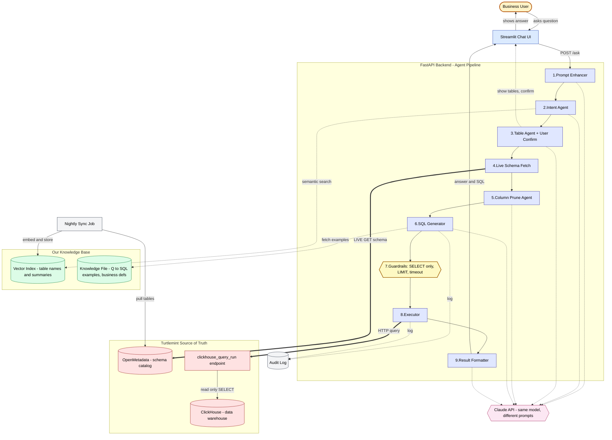

# NL-SQL Query Processor — Architecture

## Legend

| Element | Meaning |
|---|---|
| Yellow | Business user |
| Blue | Frontend (Streamlit) |
| Purple | Backend agent pipeline (FastAPI) |
| Bright yellow | Guardrails (safety layer) |
| Green | Our knowledge base (vector index + curated examples) |
| Pink | Claude API |
| Red | Turtlemint source of truth (OpenMetadata + ClickHouse) |
| Grey | Supporting infra (sync, audit log) |

| Arrow | Meaning |
|---|---|
| Solid arrow | Main pipeline flow (stage to stage) |
| Bold arrow | Live HTTP call to a Turtlemint system at runtime |
| Dotted arrow | Side call — to Claude, knowledge base, or audit log |
